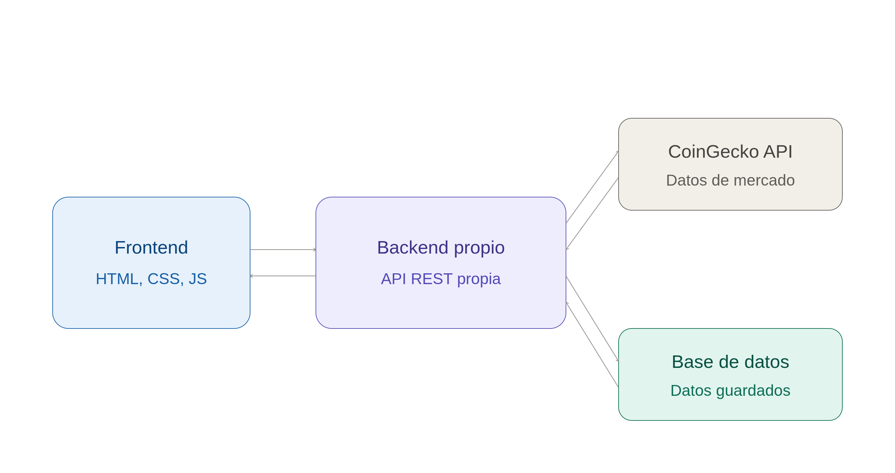
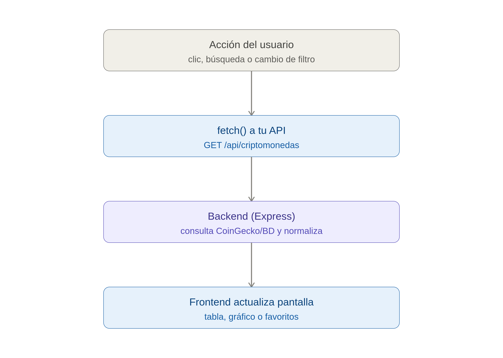

# Panel de Criptomonedas

Panel web para el seguimiento de criptomonedas en tiempo real: precios, gráficos históricos,
lista de seguimiento (favoritos) y portafolio personal.

## Características

- **Mercado**: tabla en vivo con las principales criptomonedas (precio, variación 1h/24h/7d, volumen y capitalización).
- **Buscador dinámico**: búsqueda de cualquier criptomoneda con resultados en tiempo real.
- **Gráfico histórico**: historial de precio por moneda, con filtros de 24h, 7 días y 30 días.
- **Lista de seguimiento / Portafolio**: marca tus criptomonedas favoritas y consúltalas en una vista dedicada.
- **Alertas de precio**: formulario de suscripción para recibir avisos por correo.

## Tecnologías

- **Frontend**: HTML, CSS y JavaScript (sin frameworks), Chart.js para los gráficos.
- **Backend (en diseño)**: Node.js + Express, exponiendo una API REST propia.
- **Fuente de datos**: API pública de [CoinGecko](https://www.coingecko.com/).

## Arquitectura

CryptoDash sigue una arquitectura cliente-servidor de tres capas:

- **Frontend** (HTML, CSS, JS): interfaz de usuario, tabla de precios, gráfico y favoritos.
- **Backend propio** (Node.js + Express): expone una API REST sobre el recurso `criptomoneda`,
  actuando como middleware entre el frontend y los proveedores de datos.
- **Fuentes de datos**: la API externa de CoinGecko (precios en tiempo real) y una base de datos
  propia (historial de precios, favoritos/portafolio por usuario).

### Diagrama cliente-servidor



El frontend se comunica con un backend propio construido en Node.js y Express, que expone una
API REST sobre el recurso `criptomoneda`. El backend actúa como intermediario: consulta la API
externa de CoinGecko para obtener precios en tiempo real y una base de datos propia para el
historial de precios y los favoritos/portafolio de cada usuario, normalizando todo antes de
responder al cliente.

### Flujo de datos



Cuando el usuario interactúa con la interfaz (clic, búsqueda o cambio de filtro), el frontend
hace una petición `fetch()` a `/api/criptomonedas`. El backend recibe la petición, consulta
CoinGecko y/o la base de datos según corresponda, normaliza la respuesta en formato JSON y la
envía de vuelta al cliente, que actualiza la tabla, el gráfico o la lista de favoritos.

## Diseño del backend

### Recurso central

La entidad central del proyecto es **`criptomoneda`** (en rutas y base de datos: `crypto` o
`criptomonedas`). Representa cada activo digital negociable (Bitcoin, Ethereum, Solana, etc.) y
combina datos identificativos permanentes con métricas financieras dinámicas. Todas las
funcionalidades del sistema —favoritos, alertas, gráficos, portafolio— dependen de ella. Se
relaciona con:

- `usuario` ↔ `criptomoneda` — relación **N:M** (favoritos / cartera de inversión)
- `criptomoneda` → `historial_precios` — relación **1:N** (alimenta las gráficas por intervalo)

### Endpoints

API RESTful sobre el recurso `criptomoneda`:

| Método | Ruta | Descripción | Uso en la app |
|---|---|---|---|
| `GET` | `/api/criptomonedas` | Lista general de criptomonedas | Carga el Top 10 inicial o filtra por búsqueda |
| `GET` | `/api/criptomonedas/:id` | Detalle de una criptomoneda específica | Alimenta el gráfico histórico o la vista detallada |
| `POST` | `/api/criptomonedas` | Registra una nueva criptomoneda | El administrador añade activos al catálogo |
| `PUT` | `/api/criptomonedas/:id` | Actualiza una criptomoneda existente | Corrige precio, volumen, nombre o logo |
| `DELETE` | `/api/criptomonedas/:id` | Elimina una criptomoneda | Da de baja un activo que dejó de cotizar |

### Ejemplo de respuesta JSON

Respuesta de `GET /api/criptomonedas/:id`:

```json
{
  "estado": "exito",
  "datos": {
    "id": "bitcoin",
    "nombre": "Bitcoin",
    "simbolo": "BTC",
    "precio_usd": 64250.50,
    "cambio_porcentaje_1h": 0.25,
    "cambio_porcentaje_24h": 1.15,
    "cambio_porcentaje_7d": -2.40,
    "volumen_24h": 28940000000,
    "capitalizacion_mercado": 1265000000000,
    "imagen_url": "https://assets.coingecko.com/coins/images/1/large/bitcoin.png"
  }
}
```

### Elección del lenguaje de backend

**Node.js + Express**, justificado por:

- **Homogeneidad tecnológica**: JavaScript tanto en frontend (DOM, Chart.js) como en backend,
  reduciendo el cambio de contexto y facilitando el mantenimiento del código.
- **Manejo de asincronía**: Node.js está optimizado para operaciones de I/O no bloqueantes,
  clave para las solicitudes frecuentes a APIs externas como CoinGecko, sirviendo datos al
  cliente con baja latencia.
- **Ecosistema y escalabilidad**: Express simplifica el enrutamiento RESTful y el manejo de
  datos en formato JSON mediante controladores estructurados.

## Estructura del proyecto


```
├── index.html          # Página principal (Mercado)
├── portafolio.html     # Página de Portafolio
├── intercambio.html    # Página de Intercambio
├── app.js              # Lógica del frontend (fetch, gráfico, favoritos, formulario)
├── stylesheet.css       # Estilos
└── docs/
    └── diagramas/       # Diagramas de arquitectura y flujo de datos
```
